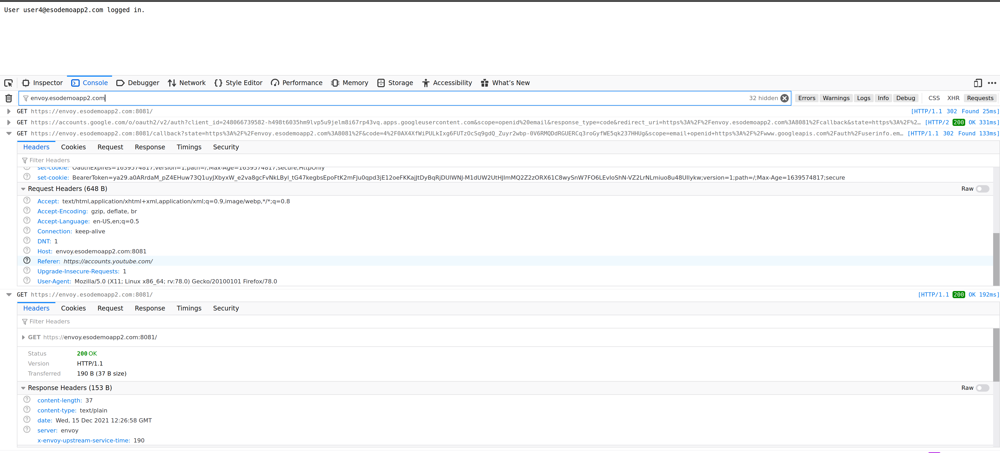
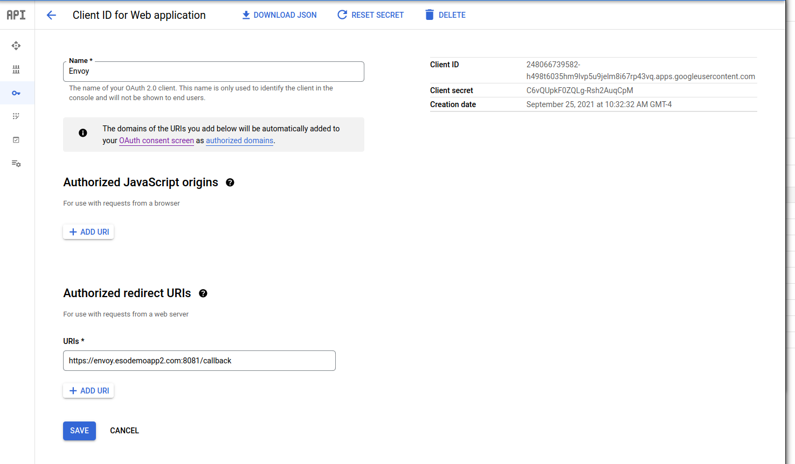

## Envoy Oauth2 Filter

A simple sample demonstrating [Envoy's Oauth2 Filter](https://www.envoyproxy.io/docs/envoy/latest/configuration/http/http_filters/oauth2_filter).

Basically, this filter will handle all the details for [OAuth 2.0 for Web Server Applications](https://developers.google.com/identity/protocols/oauth2/web-server) and once a user is validated, it will forward the user to the backend application.

Web applications can certainly handle the oauth2 flow (see [flask plugin](https://flask-oauthlib.readthedocs.io/en/latest/oauth2.html)) but this filter manages the sessions for you and after a successful login, provides an `HMAC` confirmation that a login happened and optionally the raw `access_token` for the user that logged in.

As with the nature of envoy, this configuration will act to do all the legwork for you and present a backend service you run with the user's oauth2 authentication token (i.,e envoy does the whole oauth2 flow for you).

At a high level, its basically

1. user access a url handled by envoy
2. envoy presents user with oauth2 flow and redirects to google
3. user logs into google and is redirected back to envoy
4. envoy completes the oauth2 flow and acquires the user's `access_token`.
5. envoy signs an hmac cookie and sends that to the user along with a redirect to the url requested in `1`
6. user requests the URL and provides the hmac cookies forward
7. envoy verifies the cookies and forwards the requests to the backend server
8. backend server verifies the hmac values match and extracts optionally the `access_token`



Note, part of this tutorial is inspired by [veehaitch@](https://github.com/veehaitch/envoy-oauth2-filter-google).  The enhancement i added is to do hmac validation.

### Setup

This tutorial runs envoy and backend server locally for testing. Envoy will run on port `:8081` while the backend server on `:8082`, both over TLS.


#### Configure client_id/secret

The first step is to configure an oauth2 `client_id` and `client_secret`.  For google cloud, configure one [here](https://developers.google.com/identity/gsi/web/guides/get-google-api-clientid).

For this tutorial, you can set the `Authorized Redirect Uri` value to `https://envoy.esodemoapp2.com:8081`.  



Note, I've setup DNS resolution on that domain to point back to "localhost" (which is where this tutorial takes place and where envoy and backend servers run)

```
$ nslookup envoy.esodemoapp2.com 8.8.8.8
Name:	envoy.esodemoapp2.com
Address: 127.0.0.1

$ nslookup backend.esodemoapp2.com 8.8.8.8
Name:	backend.esodemoapp2.com
Address: 127.0.0.1
```

Once you have the `client_id` and `secret`, 

for the `client_id`, edit `proxy.yaml` and set the value:

```yaml
    credentials:
      client_id: "248066739582-h498t6035hm9lvp5u9jelm8i67rp43vq.apps.googleusercontent.com"
```

for the `client_secret`, edit `token-secret.yaml` file and enter it in there

also note, the HMAC secret is also specified in a file appropriately named `hmac-secret.yaml`


The `token-secret`, `client_id` and `client_secret` are now all set


#### Start Envoy

First get the latest envoy binary:

```
 docker cp `docker create envoyproxy/envoy-dev:latest`:/usr/local/bin/envoy .
```

Then just run envoy

```
./envoy --base-id 0 -c proxy.yaml
```

#### Start backend service

Now run the backend service webserver

```
go run main.go --validateUser
```

In an incognito browser, goto 

* [https://envoy.esodemoapp2.com:8081/get](https://envoy.esodemoapp2.com:8081/get)

This will redirect you back to google oauth2 login screens where you can login.

Once logged in, you'll get redirected back though envoy and ultimately to the backend service.

THe backend service will receive the following

* `OauthExpires`: when this cookie expires
* `Host`: the standard host header
* `BearerToken`:  this is the raw oauth2 `access_token`.  This value is optionally enabled using the `forward_bearer_token: true` flag in `proxy.yaml`
* `OauthHMAC`: the hmac of `hmac(OauthExpiresHostBearerToken)`

The backend service will verify the HMAC cookies sent by envoy using the shared secret value that envoy was setup with.  In other words, the backend service should extract the cookies and host header and perform the same HMAC and check the authenticity of the provided cookie.

The provided backend service does one optional flow as well:  it uses [oauth2 tokeninfo](https://pkg.go.dev/google.golang.org/api@v0.63.0/oauth2/v2) endpoint to determine who the user is

You can also terminate envoy's session by invoking the `/signout` url at anytime.  This will invalidate all the cookies.


One more thing to note, while users can use any system to perform oauth2 flows, [Scopes](https://developers.google.com/identity/protocols/oauth2/scopes) are [restricted or sensitive](https://support.google.com/cloud/answer/9110914).  In other words, you can't just ask a user for their `cloud-platform` enabled `access_token` and start doing stuff.
